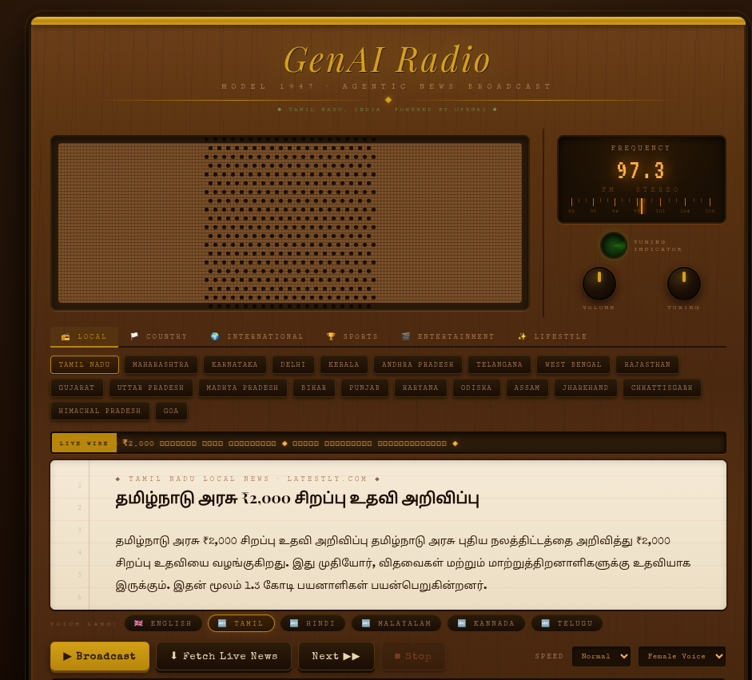

# 📻 GenAI Radio — Agentic AI News Broadcast System

> A retro 1947 wood-finish radio cabinet that searches the live web for real news, rewrites it as broadcast scripts using GPT-4o, and reads it aloud in Tamil, Hindi, Malayalam, Kannada, Telugu or English.


---

## ✨ What Is This?

GenAI Radio is a **fully agentic AI news broadcast system** built as a single self-contained HTML file. It combines live web search, large language model articulation, and multilingual text-to-speech to deliver a real-time radio news experience — all inside a hand-crafted retro radio UI built entirely with CSS.

No backend. No build step. No frameworks. Just drop it in a browser.

---

## 🎬 Demo

| Feature | Preview |
|---|---|
| Wood-finish retro cabinet | Walnut grain, brass trim, fabric speaker grille — pure CSS |
| Live news fetch | Searches today's news via `gpt-4o-search-preview` |
| Broadcast scripting | GPT-4o rewrites raw news into polished radio scripts |
| Multilingual TTS | Reads aloud in 6 languages via ResponsiveVoice |
| Word highlight | Words glow amber as they're spoken |
| Magic Eye tube | Vintage green tuning indicator pulses when on air |

---

## 🧠 How It Works — The Agentic Pipeline

```
User selects Channel + Language
        │
        ▼
┌─────────────────────────────────┐
│  STEP 1: Live Web Search        │
│  Model: gpt-4o-search-preview   │
│  Fetches real headlines & facts │
│  from the live web today        │
└────────────────┬────────────────┘
                 │  Raw news text
                 ▼
┌─────────────────────────────────┐
│  STEP 2: Broadcast Articulation │
│  Model: gpt-4o                  │
│  Rewrites into polished radio   │
│  scripts in chosen language     │
└────────────────┬────────────────┘
                 │  JSON { headline, summary, ticker, source }
                 ▼
┌─────────────────────────────────┐
│  STEP 3: Text-to-Speech         │
│  Engine: ResponsiveVoice        │
│  Reads aloud with word-by-word  │
│  highlight animation            │
└─────────────────────────────────┘
```

This is **not** a chatbot wrapper. It's a real two-step agentic pipeline — search first, articulate second — so the news is live and factual, not hallucinated.

---

## 📺 Channel Guide

| Tab | Sub-channels |
|---|---|
| 📻 **Local** | Every state/region in your country (e.g. Tamil Nadu, Maharashtra, Karnataka…) |
| 🏳️ **Country** | Top Stories, Politics, Economy, Sci & Tech, Health, Education, Weather |
| 🌍 **International** | World, Geopolitics, Global Economy, Climate, Asia Pacific, Europe, Americas, ME & Africa |
| 🏆 **Sports** | Headlines, Cricket, Football, Basketball, Tennis, Formula 1, Olympics, Local Sports |
| 🎬 **Entertainment** | Bollywood, Kollywood, Hollywood, Music, TV & OTT, Gaming, Books |
| ✨ **Lifestyle** | Food, Travel, Fashion, Wellness, Family, Finance, Culture |

---

## 🗣️ Supported Languages

| Language | Voice Options |
|---|---|
| 🇬🇧 English | UK Female / Male |
| 🔤 Tamil (தமிழ்) | Female / Male |
| 🔤 Hindi (हिंदी) | Female / Male |
| 🔤 Malayalam (മലയാളം) | Female / Male |
| 🔤 Kannada (ಕನ್ನಡ) | Female / Male |
| 🔤 Telugu (తెలుగు) | Female / Male |

When a non-English language is selected, GPT-4o writes the entire broadcast — headline, summary, and ticker — in that language's script.

---

## 🚀 Getting Started

### Prerequisites

- An **OpenAI API key** with access to:
  - `gpt-4o`
  - `gpt-4o-search-preview`
- A modern browser (Chrome, Edge, Firefox, Safari)
- Internet connection

### Usage

1. **Clone or download** this repository:
   ```bash
   git clone https://github.com/senthilthangaiah/RADIO_AGENT.git
   cd genai-radio
   ```

2. **Open** `genai-news-radio.html` directly in your browser — no server needed.

3. **Enter your OpenAI API key** in the setup screen.

4. **Select your country and state/region.**

5. **Pick a channel tab** and a sub-channel.

6. **Choose your broadcast language** using the language pills.

7. Press **⬇ Fetch Live News** — watch it search the web and script the broadcast.

8. Press **▶ Broadcast** — sit back and listen.

---

## 🔑 API Key Setup

Your API key is:
- Entered once at startup
- Stored **only in memory** (never written to disk or localStorage)
- Sent **only to `api.openai.com`** — nowhere else
- Cleared when you close the tab

> ⚠️ This app makes direct browser-to-OpenAI API calls. Do not share your API key publicly or embed it in source code.

---

## 🏗️ Tech Stack

| Layer | Technology |
|---|---|
| UI / Cabinet | Vanilla HTML + CSS (wood grain, brass, fabric — zero images) |
| Live Search | OpenAI `gpt-4o-search-preview` |
| Broadcast Scripting | OpenAI `gpt-4o` |
| Text-to-Speech | [ResponsiveVoice](https://responsivevoice.org/) |
| Runtime | Vanilla JavaScript (ES2020+) |
| Dependencies | **Zero** npm packages |
| Deployment | Single static HTML file |

---

## 📁 Project Structure

```
genai-radio/
│
├── genai-news-radio.html    # The entire application (HTML + CSS + JS)
└── README.md                # This file
```

Everything lives in one file by design — making it trivially easy to share, host on GitHub Pages, or embed anywhere.

---

## 🎨 UI Design Details

The radio cabinet is built entirely from CSS — no images or SVGs:

- **Wood grain** — layered `repeating-linear-gradient` at 88° and 92° over a mahogany base
- **Brass trim** — gold gradient top bar, dividers, and button accents
- **Speaker fabric** — CSS crosshatch pattern over a tan weave base with individual dot holes
- **Bakelite knobs** — radial gradient dark brown with a rotating brass indicator dot
- **Frequency dial** — VT323 monospace font on a dark amber background with glow shadow
- **Magic Eye tube** — `conic-gradient` rotating animation simulating an EM34 vacuum tube
- **Story card** — cream notepad with ruled lines, red margin line, and Playfair Display serif
- **Ticker tape** — CSS scroll animation on a dark walnut strip

---

## ⚙️ Configuration

You can customise the following directly in the HTML source:

```javascript
// Add more countries and states
const STATES = {
  'Your Country': ['Region 1', 'Region 2', ...],
  ...
};

// Add more language voices (ResponsiveVoice voice names)
const LANG_CONFIG = {
  'Bengali': { rvFemale: 'Bengali Female', rvMale: 'Bengali Male', prompt: 'Bengali (বাংলা)' },
  ...
};

// Adjust FM frequency per channel tab
const FREQ_MAP = {
  local: 88.5, country: 91.0, international: 94.0,
  sports: 97.3, entertainment: 100.5, lifestyle: 103.7
};
```

---

## 🔧 Known Limitations

- **Indian language TTS** — ResponsiveVoice's free tier supports Tamil, Hindi, and a few others. Some languages may require a paid subscription for full voice quality.
- **API costs** — Each "Fetch Live News" makes 2 OpenAI API calls (search + articulate). Monitor your usage at [platform.openai.com](https://platform.openai.com/usage).
- **`gpt-4o-search-preview`** — Web search availability depends on your OpenAI account tier. If unavailable, the app will show an error on fetch.
- **Word highlight timing** — ResponsiveVoice does not expose word boundary events, so word highlighting uses a timer estimate. Accuracy varies by speed setting and language.

---

## 🌐 Hosting on GitHub Pages

1. Push `genai-news-radio.html` to your repo
2. Go to **Settings → Pages**
3. Set source to **main branch / root**
4. Your radio will be live at `https://github.com/senthilthangaiah/RADIO_AGENT/genai-news-radio.html`

> Users will need to enter their own OpenAI API key — it is never shared or stored server-side.

---

## 🤝 Contributing

Contributions are welcome! Some ideas for extension:

- [ ] Add more Indian languages (Bengali, Marathi, Gujarati, Punjabi)
- [ ] Podcast mode — save broadcast audio to file
- [ ] Schedule mode — auto-fetch news at set intervals
- [ ] Share a story — generate a shareable summary card
- [ ] Anthropic Claude support alongside OpenAI

To contribute:
```bash
git fork https://github.com/senthilthangaiah/RADIO_AGENT.git
git checkout -b feature/your-feature
# make changes to genai-news-radio.html
git commit -m "feat: your feature description"
git push origin feature/your-feature
# open a Pull Request
```

---

## 📄 License

MIT License — free to use, modify, and distribute. See [LICENSE](LICENSE) for details.

---

## 🙏 Acknowledgements

- [OpenAI](https://openai.com) — GPT-4o and live web search
- [ResponsiveVoice](https://responsivevoice.org) — Multilingual browser TTS
- [Google Fonts](https://fonts.google.com) — Special Elite, Playfair Display, VT323, Cutive Mono

---

## 👨‍💻 Author

Built by **Senthil Thangaiah**


## Snapshot





---

*If this project helped you or inspired something, please ⭐ star the repo — it helps others find it!*
